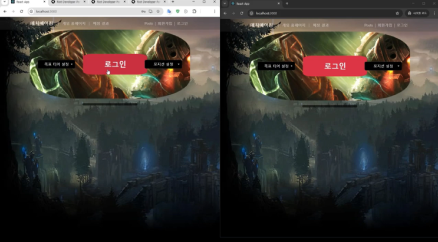
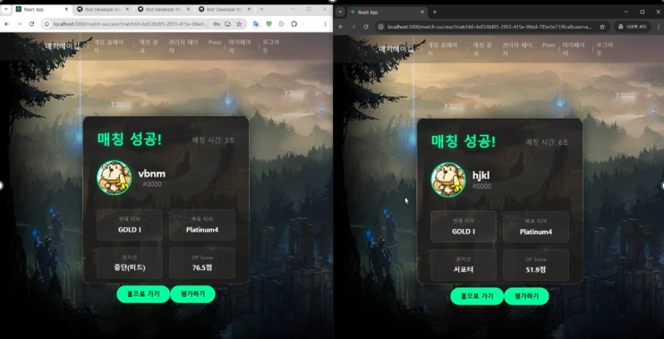

리그 오브 레전드 듀오 매치메이킹 서비스 개발 (캡스톤 디자인 매칭의 정상화 팀 프로젝트)
기간: [2024.09~2025.06]

목표: 온라인 AOS 게임 '리그 오브 레전드'의 랭크 게임 내 '트롤링' 문제 완화 및 신뢰 기반의 최적 듀오 파트너 매칭 시스템 구축.

GitHub Link: https://github.com/ABJUNG/lol-duo-matchmaking

주요 기여 및 기술적 성과
데이터 기반의 고유 매치메이킹 알고리즘 개발 및 구현 (핵심 로직)

Lol 외부 전적 검색 사이트의 스코어 기준을 재해석하여, 최근 10~20경기의 승률, KDA, 획득 골드, 시야 점수 등을 종합적으로 수치화한 'OP 스코어' 정의.

정의된 OP 스코어를 기반으로 사용자에게 가장 적합한 듀오 파트너를 연결하는 매칭 로직을 설계하고 Spring 백엔드에서 구현 완료.

LoL API 연동 안정성 확보를 위한 자동화 시스템 구축

24시간마다 수동으로 갱신해야 하는 Riot Games API 키 관리의 비효율성 문제를 해결.

API 키를 자동으로 갱신하여 서비스의 데이터 연동이 중단 없이 지속되도록 하는 모듈을 개발하여 서비스 운영 안정성을 확보.\

핵심 백엔드 시스템 및 데이터베이스 설계

서비스의 매칭, 데이터 처리 등 핵심 로직을 처리하는 Spring(Java) 기반 백엔드 모듈 설계 및 구현.

사용자 데이터 및 매칭 정보를 관리하기 위한 MySQL 데이터베이스 설계 및 구축.

시각적 결과물

프로젝트 결과
직접적인 데이터 분석은 시간 제약으로 진행하지 못했지만, 본 서비스를 활용하는 플레이어의 랭크 게임 평균 승률이 상승할 것으로 예측하고 있습니다. 추후에는 매치메이킹 로직에 머신러닝 기술을 적용하여 예측 정확도를 더욱 높이고, 사용자 플레이 스타일에 대한 심층 분석을 통해 더 정교한 매칭 서비스를 제공하고 싶습니다.

기술 스택 (Tech Stack)
구분	      기술 내용
Backend	    Spring, Java
Frontend	  React.js
Database	  MySQL
Deployment	Local (캡스톤 디자인 환경)
